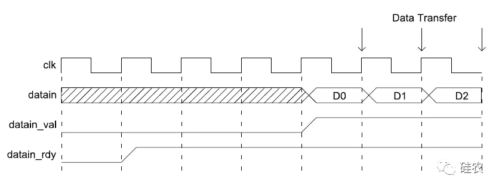
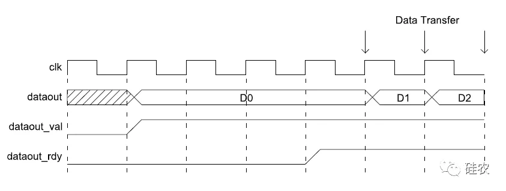

#### 跨时钟域CDC

https://www.cnblogs.com/icparadigm/p/12794483.html 
https://www.cnblogs.com/icparadigm/p/12794422.html

- 亚稳态

  - 是什么

    时序逻辑在跳变时，由于异步信号、跨时钟域等原因，不满足setup或hold条件，输出在0和1之间产生振荡。

  - 原因

    D触发器的内部是一个主从锁存器(master-slave latch)，依靠背靠背的反相器锁存数据。

    

    时钟为低电平时，主锁存器更新输入值，从锁存器保持上一个输出值不变。

    

    时钟为高电平时，主锁存器保持上一个输出值不变，从锁存器更新输入。

    

    由于反相器需要一定时间才能锁定，若时钟跳变前后，未完成锁存时钟就改变，最后输出的电平高低会不稳定，这就是亚稳态。

  - 危害

    错误的逻辑会一直传递下去导致系统错误。

  - 指标

    MTBF-- mean time between failure. 两次失效之间的平均时间。
    $$
    MTBF(T_{MET})=\frac{e^{T_{MET}}}{C_1} * \frac{1}{C_2*f_{clk}*f_{data}}
    $$
    C1 和C2 是常数，依赖于器件工艺和操作环境。

    fCLK 和fDATA 参数取决于设计规格：fCLK 是接收异步信号的时钟域的时钟频率，fDATA 是异步数据的翻转频率（toggling frequency）。

    TMET 参数是亚稳态转稳定的时间（Metastability setting time）,或者说时序裕量大于寄存器Tco可以让潜在的亚稳态信号达到稳定的值的时间。**TMET 对同步链来说就是链中每个寄存器输出时序裕量的和。**

  - 减少亚稳态的方法

    1. 改善工艺
    2. 降低时钟速率和数据翻转。
    3. 增大时序裕量（使用多级同步器打拍）

- 单bit情况

  - 慢时钟域到快时钟域（**目标时钟频率必须是源时钟频率1.5倍或者以上**）

    电平同步，直接打拍。

    ```verilog
    /*
               +---------+        +---------+       +---------+
    asynch_in  |         | meta1  |         | meta2 |         | synch_out
    +----------+ D     Q +--------+ D     Q +-------+ D     Q +-------+
               |         |        |         |       |         |
     clk_b     |         | clk_b  |         |  clk_b|         |
    +----------+ CLK     | +------+ CLK     | +-----+ CLK     |
               |    R    | |      |     R   | |     |         |
               +----+----+ |      +-----+---+ |     +----+----+
                    |      +            |     +          |
                    |                   |                |
                    |                   |                |
     +--------------+-------------------+----------------+
    
    */
    
    always @(posedge clk_b or posedge rst) begin
        if(rst) begin
            meta1<=0;
            meta2<=0;
            synch_out<=0;
        end
        else begin
            meta1<=asynch_in;
            meta2<=meta1;
            synch_out<=meta2;
        end
    end
    assign pos_out_b=synch_out&~meta2;//高电平跳变沿
    assign neg_out_b=~synch_out&meta2;//低电平跳变沿
    ```

    

  - 快时钟域到慢时钟域

    脉冲同步器，即加握手信号，通过组合逻辑把脉冲展宽为电平信号，再向clkb传递，当确认clkb已经“看见”信号同步过去之后，再清掉clka下的电平信号。在应答信号到来之前，不允许源信号改变,可能漏采。

    ```verilog
    module pluse_sync
    (
        input rst_n,
        input clk_a,
        input clk_b,
        input pulse_a_in,
        output pulse_b_out,
        output level_b_out
    );
        reg q;//展宽脉冲信号
        reg q1_a2b,q2_a2b,sync_out;//a向b同步信号
        reg q1_b2a,q2_b2a;//b向a同步信号
        
        //q的置位与清零
        always @(posedge clk_a or negedge rst_n) begin
            if(~rst_n)
                q<=0;
            else if(pulse_a_in)
                q<=1;
            else if(q2_b2a)
                q<=0;        
        end
        
        //
        always@ (posedge clk_b or negedge rst_n) begin
            if(~rst_n) begin
                q1_a2b<=0;
                q2_a2b<=0;
                sync_out<=0;
            end
            else begin
                q1_a2b<=q;
                q2_a2b<=q1_a2b;
                sync_out<=q2_a2b;
            end
        end
        
        //
        always@(posedge clk_a or negedge rst_n) begin
            if(~rst_n) begin
                q1_b2a<=0;
                q2_b2a<=0;
            end
            else begin
                q1_b2a<=sync_out;
                q2_b2a<=q1_b2a;
            end
            assign pulse_b_out=sync_out&(~q2_a2b);
            assign level_b_out=sync_out;
    endmodule
    ```

    

  - **在使用同步器同步信号时，要求输入信号必须是源时钟域的寄存输出**。即Asynch_in必须是clk_a的DFF信号，中间不能经过组合逻辑。原因：根据FF的特性，输出在一个时钟周期内是不会改变的，数据的变化频率不会超过时钟频率，这样就能降低跨时钟信号变化的频率，减小亚稳态发生的概率

  - 应用

    - 输入去抖debounce

      ```verilog
      //可以滤掉的宽度是两个clk的cycle，对于大于两个cycle而小于三个cycle的信号，有些可以滤掉，有些不能滤掉，这与signal_i相对clk的相位有关。
      parameter BIT_NUM  = 4 ;
      reg [BIT_NUM-1 : 0] signal_deb ; 
      always @ (posedge clk or negedge rst_n)
      begin
          if (rst_n == 1'b0)
              signal_deb <= {BIT_NUM{1'b0}} ;
          else
              signal_deb <= # DLY {signal_deb[BIT_NUM-2:0],signal_i} ;
      end
      
      always @ (posedge clk or negedge rst_n)
      begin
          if (rst_n == 1'b0)
              signal_o <= 1'b1 ;
          else if (signal_deb[3:1]==3'b111) 
              signal_o <= # DLY 1'b1 ;
          else if (signal_deb[3:1]==3'b000)
              signal_o <= # DLY 1'b0 ;
          else ;
      end
      ```

      根据希望滤除的宽度，换算到clk下是多少个cycle数，从而决定使用多少级DFF。

      如果希望滤除的宽度相对cycle数而言较大，可以先在clk下做一个计数器，产生固定间隔的脉冲，再在脉冲信号有效时使用多级DFF去抓signal_i；或者直接将clk分频后再使用。

      也不一定全为1或0才判断有效/无效，见project/uart_tx 输入去抖。

- 多bit情况

  - 多个信号合并

    如果可能，将多个信号合为一个传递。

  - 多周期路径法

    （常见于单bit同步，多bit一般用AFIFO）

  - 使用格雷码传递多个CDC位

    格雷码最常见的应用是在异步FIFO中,相邻的状态只变化一位，转化为单bit情况。

    **格雷码必须是计数到2^n才是每次改变一个bit。**如果计数器是从0~5计数，那么从5->0的计数，不止一个bit改变，就失去了只改变一个bit的初衷。所以就算浪费面积，也需要把FIFO深度设置为2^N。

  - 使用异步FIFO来传递多位信号

- Valid-Ready握手协议

  https://blog.csdn.net/maowang1234588/article/details/100065072

  VALID信号由源设备控制，READY信号由宿设备控制。源设备拉起VALID信号表示其把数据（或地址等信号）放上了总线，等待宿设备接收；在宿设备接收数据以前，源设备必须要保持住总线上的数据不变。宿设备只有在可以接收数据时，才可以拉起READY信号，否则只能拉低READY信号。只有当VALID和READY信号同时有效时，一次数据传输才算完成。

  AXI协议保障数据正确传输使用了该握手协议，所有的通道都采用同样的握手协议。

  Valid-Ready信号产生有两种情况。

  - Ready-Before-Valid

    Ready-Before-Valid是Ready信号在Valid信号之前有效。在数据来临之前，通道已准备好接收数据，可以保持通道的最大吞吐量，因为Ready先产生，这个通道保持刷新等待数据。通道作为接受数据端采用这样的设计。

    

  - Valid-before-Ready

    Valid-before-Ready是Valid信号在Ready信号之前有效。通道作为数据输出端采用这样的设计。收到下游接收端的准备接收信号，才开始传输数据。

    

  - Stalemate 死锁

    输出端用Ready-Before-Valid而接受端使用Valid-before-Ready，就会出现输出端等待接受端给出的Ready来输出数据，但是接收端也在等待输出端给出Valid信号来接受数据。两者都在等待却没有一方先给，所以这个时候这个通道就是无效的，被“锁住”了。

  - verilog实现

    - 无缓存（见典型电路）

    - 带缓存（用同步FIFO实现）
    
      
    
      ```verilog
      assign  valid_o = ~fifo_empty;
      assign  ready_o = ~fifo_full;
      assign  wr_en = ready_o & valid_i;
      assign  rd_en = ready_i & valid_o;
      ```

