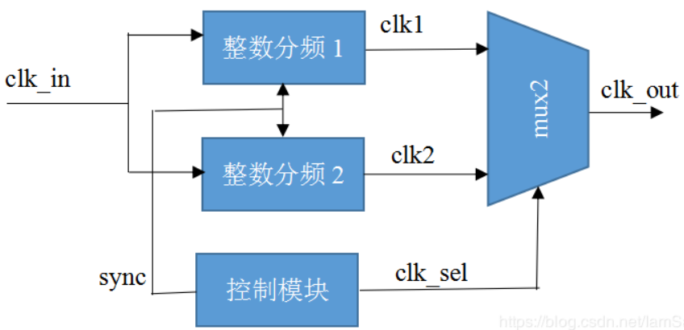

#### 同步与异步复位 

- 同步复位的优点大概有3条：
      a、有利于仿真器的仿真。
      b、有利于时序分析，而且综合出来的fmax一般较高。
      c、只有在时钟有效电平到来时才有效，所以可以滤除高于时钟频率的毛刺。
      缺点主要有以下几条：
      a、复位信号的有效时长必须大于时钟周期，才能真正被系统识别并完成复位任务。同时还要考虑，诸如：clk skew,组合逻辑路径延时,复位延时等因素。
      b、FPGA内寄存器中支持异步复位专用的端口CLR，所以，倘若采用同步复位的话，综合器就会在寄存器的数据输入端口插入组合逻辑，这样就会耗费较多的逻辑资源。

- 对于异步复位来说，他的优点也有三条：
      a、大多数目标器件库的dff都有异步复位端口，因此采用异步复位可以节省资源。
      b、设计相对简单。
      c、异步复位信号识别方便，而且可以很方便的使用FPGA的全局复位端口GSR。
      缺点： 
      a、在复位信号释放(release)的时候容易出现问题。具体就是说：倘若复位释放时恰恰在时钟有效沿附近，就很容易使寄存器输出出现亚稳态，从而导致亚稳态。
      b、复位信号容易受到毛刺的影响。

- 异步复位同步释放电路

  同步复位和异步复位都不可靠，将两者结合，取长补短,既解决了同步复位的资源消耗问题，也解决了异步复位的亚稳态问题。其根本思想，也是将异步信号同步化。

  ```verilog
  always @ (posedge clk)
      rst_n <= a_rst_n;                 //关键：异步复位信号用同步时钟打一拍(也可以多拍)
  
  always @ (posedge clk or negedge rst_n)
           if(!rst_n) b <= 1'b0;
           else b <= a;
  always @ (posedge clk or negedge rst_n)
           if(!rst_n) c <= 1'b0;
           else c <= b;     
  
  
  
  /*另一种写法*/
  //Synchronized Asynchronous Reset
  module sync_async_reset(clock,reset_n,data_a,data_b,out_a,out_b);
   
      input clock, reset_n;   
      input data_a, data_b;
      output out_a, out_b;
   
      reg rst_nr, rst_n;
  	reg out_a, out_b;
   
      always @(posedge clock or negedge reset_n) begin
          if(!reset_n) begin
  			rst_nr <= 1'b0;
              rst_n <= 1'b0;			//异步复位
          end
          else begin
  			rst_nr <= 1'b1;
  			rst_n <= rst_nr;		//同步释放
  		end
      end
  	
      //信号rst_n作为新的总的复位信号，后续可以以“异步”做复位使用
      always @(posedge clock or negedge rst_n) begin
          if(!rst_n) begin
              out_a <= 1'b0;
              out_b <= 1'b0;
          end
          else begin
  			out_a <= data_a;
  			out_b <= data_b;
          end
      end
  	
  endmodule  // sync_async_reset
  ```

  

#### 分频计数器

- 奇数

  对于实现占空比为50%的N倍奇数分频，可以分解为两个通道：

  - 上升沿触发进行模N计数，计数选定到某一个值进行输出时钟翻转，然后经过（N-1）/2再次进行翻转得到一个**占空比为非50%奇数N分频时钟**；
  - 下降沿触发进行模N计数，到和上升沿触发输出时钟翻转选定值相同值时，进行输出时钟时钟翻转，同样经过（N-1）/2时，输出时钟再次翻转生成**占空比非50%的奇数N分频时钟**。

  将这两个占空比非50%的N分频时钟**或运算**，得到**占空比为50%的奇数n分频时钟**。

  

  

  或者 用上升沿与下降沿分别做**2N**的分频。让后**异或**


  ​        

  

- 偶数

  直接计数到N/2-1,翻转时钟即可。

  

  

- 小数

  要求精确的时候用PLL先倍频再分频。对于相位和占空比要求不严格，若要求N=M.D>1分频，分为整数M和小数D，我们使用M分频和M+1分频来构成M.D分频。

  

### clock gating

- 用AND门有一个显而易见的缺陷，由于当EN的变化会立刻反映到输出端，AND门输出会产生glitch。

  因此，**只需要控制EN到达AND门的时间，使得EN只在CLK为低的时候变化**

```verilog
always @ (clk_in or EN)  begin
   if ( ! clk_in) 
      clkEn <= EN;
end
assign gated_clk = clkEn & clk_in;
```

- 实际工程中，应尽量避免显式写上面的clock gating。厂家工艺库通常会提供integrated clock gating cell (ICG), 综合工具在综合时可以自动选择ICG插入在需要gating的地方。因为综合工具对上面的代码会综合出一个latch和一个AND门，而后端布局布线时可能会使得这两个门距离较远，timing上会受影响。而ICG是一个standard cell，则保证了latch和AND门距离很近。

- 无毛刺时钟切换 

  基本思路：根据clock gating，使用负沿触发的flip-flop，确保sel信号在低电平时候更新，同时用and gate确保在时钟高电平时切换。

  

  问题：sel信号异步可能带来亚稳态，所有要加同步器。

  

  新的问题：

  1.引入同步器，当SEL变化到en0发生变化需要2个CLK0周期，才能把CLK0停下来；

  2.同上的理由，clk停下后目标clock不是马上开始反转，存在gap；

  3.在负沿触发的flop之前只加了一级正沿触发的flop，这样留给flop输出稳定下来的时间只有**半个周期**，可能会使得MTBF达不到我们需要的值。

  4.综合时候后面的两个AND门和OR门要设为don‘t touch

​	如果不用负沿触发的flop，可将最后的and门替换为门控时钟cell，同时en0之后再加一级flop，将延一拍之后的en0b_dly反馈给另外一路，这样才能保证在当前路**完全关断**的情况下切换.(也可以额外定义反向时钟)


