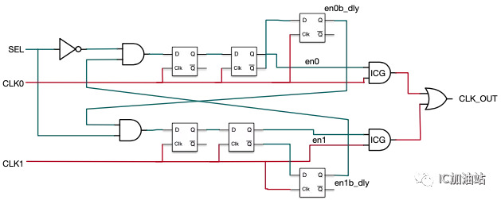

#### HDLBits重点复习

#### 同步与异步复位 

- 同步复位的优点大概有3条：
      a、有利于仿真器的仿真。
      b、有利于时序分析，而且综合出来的fmax一般较高。
      c、只有在时钟有效电平到来时才有效，所以可以滤除高于时钟频率的毛刺。
      缺点主要有以下几条：
      a、复位信号的有效时长必须大于时钟周期，才能真正被系统识别并完成复位任务。同时还要考虑，诸如：clk skew,组合逻辑路径延时,复位延时等因素。
      b、FPGA内寄存器中支持异步复位专用的端口CLR，所以，倘若采用同步复位的话，综合器就会在寄存器的数据输入端口插入组合逻辑，这样就会耗费较多的逻辑资源。
- 对于异步复位来说，他的优点也有三条：
      a、大多数目标器件库的dff都有异步复位端口，因此采用异步复位可以节省资源。
      b、设计相对简单。
      c、异步复位信号识别方便，而且可以很方便的使用FPGA的全局复位端口GSR。
      缺点： 
      a、在复位信号释放(release)的时候容易出现问题。具体就是说：倘若复位释放时恰恰在时钟有效沿附近，就很容易使寄存器输出出现亚稳态，从而导致亚稳态。
      b、复位信号容易受到毛刺的影响。
- 异步复位同步释放电路

#### 跨时钟域CDC

https://www.cnblogs.com/icparadigm/p/12794483.html 
https://www.cnblogs.com/icparadigm/p/12794422.html

- 亚稳态

  - 是什么

    时序逻辑在跳变时，由于异步信号、跨时钟域等原因，不满足setup或hold条件，输出在0和1之间产生振荡。

  - 原因

    D触发器的内部是一个主从锁存器(master-slave latch)，依靠背靠背的反相器锁存数据。

    

    时钟为低电平时，主锁存器更新输入值，从锁存器保持上一个输出值不变。

    

    时钟为高电平时，主锁存器保持上一个输出值不变，从锁存器更新输入。

    

    由于反相器需要一定时间才能锁定，若时钟跳变前后，未完成锁存时钟就改变，最后输出的电平高低会不稳定，这就是亚稳态。

  - 危害

    错误的逻辑会一直传递下去导致系统错误。

  - 指标

    MTBF-- mean time between failure. 两次失效之间的平均时间。
    $$
    MTBF(T_{MET})=\frac{e^{T_{MET}}}{C_1} * \frac{1}{C_2*f_{clk}*f_{data}}
    $$
    C1 和C2 是常数，依赖于器件工艺和操作环境。

    fCLK 和fDATA 参数取决于设计规格：fCLK 是接收异步信号的时钟域的时钟频率，fDATA 是异步数据的翻转频率（toggling frequency）。

    TMET 参数是亚稳态转稳定的时间（Metastability setting time）,或者说时序裕量大于寄存器Tco可以让潜在的亚稳态信号达到稳定的值的时间。**TMET 对同步链来说就是链中每个寄存器输出时序裕量的和。**

  - 减少亚稳态的方法

    1. 改善工艺
    2. 降低时钟速率和数据翻转。
    3. 增大时序裕量（使用多级同步器打拍）

- 单bit情况

  - 慢时钟域到快时钟域（**目标时钟频率必须是源时钟频率1.5倍或者以上**）

    电平同步，直接打拍。

    ```verilog
    /*
               +---------+        +---------+       +---------+
    asynch_in  |         | meta1  |         | meta2 |         | synch_out
    +----------+ D     Q +--------+ D     Q +-------+ D     Q +-------+
               |         |        |         |       |         |
     clk_b     |         | clk_b  |         |  clk_b|         |
    +----------+ CLK     | +------+ CLK     | +-----+ CLK     |
               |    R    | |      |     R   | |     |         |
               +----+----+ |      +-----+---+ |     +----+----+
                    |      +            |     +          |
                    |                   |                |
                    |                   |                |
     +--------------+-------------------+----------------+
    
    */
    
    always @(posedge clk_b or posedge rst) begin
        if(rst) begin
            meta1<=0;
            meta2<=0;
            synch_out<=0;
        end
        else begin
            meta1<=asynch_in;
            meta2<=meta1;
            synch_out<=meta2;
        end
    end
    assign pos_out_b=synch_out&~meta2;//高电平跳变沿
    assign neg_out_b=~synch_out&meta2;//低电平跳变沿
    ```

    

  - 快时钟域到慢时钟域

    脉冲同步器，即加握手信号，通过组合逻辑把脉冲展宽为电平信号，再向clkb传递，当确认clkb已经“看见”信号同步过去之后，再清掉clka下的电平信号。在应答信号到来之前，不允许源信号改变,可能漏采。

    ```verilog
    module pluse_sync
    (
        input rst_n,
        input clk_a,
        input clk_b,
        input pulse_a_in,
        output pulse_b_out,
        output level_b_out
    );
        reg q;//展宽脉冲信号
        reg q1_a2b,q2_a2b,sync_out;//a向b同步信号
        reg q1_b2a,q2_b2a;//b向a同步信号
        
        //q的置位与清零
        always @(posedge clk_a or negedge rst_n) begin
            if(~rst_n)
                q<=0;
            else if(pulse_a_in)
                q<=1;
            else if(q2_b2a)
                q<=0;        
        end
        
        //
        always@ (posedge clk_b or negedge rst_n) begin
            if(~rst_n) begin
                q1_a2b<=0;
                q2_a2b<=0;
                sync_out<=0;
            end
            else begin
                q1_a2b<=q;
                q2_a2b<=q1_a2b;
                sync_out<=q2_a2b;
            end
        end
        
        //
        always@(posedge clk_a or negedge rst_n) begin
            if(~rst_n) begin
                q1_b2a<=0;
                q2_b2a<=0;
            end
            else begin
                q1_b2a<=sync_out;
                q2_b2a<=q1_b2a;
            end
            assign pulse_b_out=sync_out&(~q2_a2b);
            assign level_b_out=sync_out;
    endmodule
    ```

    

  - **在使用同步器同步信号时，要求输入信号必须是源时钟域的寄存输出**。即Asynch_in必须是clk_a的DFF信号，中间不能经过组合逻辑。原因：根据FF的特性，输出在一个时钟周期内是不会改变的，数据的变化频率不会超过时钟频率，这样就能降低跨时钟信号变化的频率，减小亚稳态发生的概率

  - 应用

    - 输入去抖debounce

      ```verilog
    //可以滤掉的宽度是两个clk的cycle，对于大于两个cycle而小于三个cycle的信号，有些可以滤掉，有些不能滤掉，这与signal_i相对clk的相位有关。
      parameter BIT_NUM  = 4 ;
    reg [BIT_NUM-1 : 0] signal_deb ; 
      always @ (posedge clk or negedge rst_n)
      begin
          if (rst_n == 1'b0)
              signal_deb <= {BIT_NUM{1'b0}} ;
          else
              signal_deb <= # DLY {signal_deb[BIT_NUM-2:0],signal_i} ;
      end
      
      always @ (posedge clk or negedge rst_n)
      begin
          if (rst_n == 1'b0)
              signal_o <= 1'b1 ;
          else if (signal_deb[3:1]==3'b111) 
              signal_o <= # DLY 1'b1 ;
          else if (signal_deb[3:1]==3'b000)
              signal_o <= # DLY 1'b0 ;
          else ;
      end
      ```
    
      根据希望滤除的宽度，换算到clk下是多少个cycle数，从而决定使用多少级DFF。
    
      如果希望滤除的宽度相对cycle数而言较大，可以先在clk下做一个计数器，产生固定间隔的脉冲，再在脉冲信号有效时使用多级DFF去抓signal_i；或者直接将clk分频后再使用。
    
      也不一定全为1或0才判断有效/无效，见project/uart_tx 输入去抖。
    
    - 无毛刺时钟切换 
    
      基本思路：根据clock gating，使用负沿触发的flip-flop，确保sel信号在低电平时候更新，同时用and gate确保在时钟高电平时切换。
      
      
      
      问题：sel信号异步可能带来亚稳态，所有要加同步器。
      
      
      
      新的问题：
      
      1.引入同步器，当SEL变化到en0发生变化需要2个CLK0周期，才能把CLK0停下来；
      
      2.同上的理由，clk停下后目标clock不是马上开始反转，存在gap；
      
      3.在负沿触发的flop之前只加了一级正沿触发的flop，这样留给flop输出稳定下来的时间只有**半个周期**，可能会使得MTBF达不到我们需要的值。
      
      4.综合时候后面的两个AND门和OR门要设为don‘t touch
    
    ```verilog
    //glitch free clock switch 
    module clk_switch (
                    rst_n          , //
                    clka            , //
                    clkb            , //
                    sel_clkb      , //
                    clk_o            //
                    );
    
    //assign clka_n = ~clka;
    //assign clkb_n = ~clkb;
    
    // part1
    //always @ (posedge clka_n or negedge rst_n)
    always @ (posedge clka or negedge rst_n)
    begin
        if (!rst_n) begin
            sel_clka_d0 <= 1'b0;
            sel_clka_d1 <= 1'b0;
        end
        else begin
            sel_clka_d0 <= (~sel_clkb) & (~sel_clkb_dly3) ;
            sel_clka_d1 <= sel_clka_d0 ;
        end
    end
    
    // part2
    //always @ (posedge clka_n or negedge rst_n)
    always @ (posedge clka or negedge rst_n)
    begin
        if (!rst_n) begin
            sel_clka_dly1 <= 1'b0;
            sel_clka_dly2 <= 1'b0;
            sel_clka_dly3 <= 1'b0;
        end
        else begin
            sel_clka_dly1 <= sel_clka_d1;
            sel_clka_dly2 <= sel_clka_dly1 ;
            sel_clka_dly3 <= sel_clka_dly2 ;
        end
    end
    
    // part3
    //always @ (posedge clkb_n or negedge rst_n)
    always @ (posedge clkb or negedge rst_n)
    begin
        if (!rst_n) begin
            sel_clkb_d0 <= 1'b0;
            sel_clkb_d1 <= 1'b0;
        end
        else begin
            sel_clkb_d0 <= sel_clkb & (~sel_clka_dly3) ;
            sel_clkb_d1 <= sel_clkb_d0 ;
        end
    end
    
    // part4
    //always @ (posedge clkb_n or negedge rst_n)
    always @ (posedge clkb or negedge rst_n)
    begin
        if (!rst_n) begin
            sel_clkb_dly1 <= 1'b0;
            sel_clkb_dly2 <= 1'b0;
            sel_clkb_dly3 <= 1'b0;
        end
        else begin
            sel_clkb_dly1 <= sel_clkb_d1   ;
            sel_clkb_dly2 <= sel_clkb_dly1 ;
            sel_clkb_dly3 <= sel_clkb_dly2 ;
        end
    end
    
    // part5
    clk_gate_xxx clk_gate_a ( .CP(clka), .EN(sel_clka_dly1), .Q(clka_g)  .TE(1'b0) );
    clk_gate_xxx clk_gate_b ( .CP(clkb), .EN(sel_clkb_dly1), .Q(clkb_g)  .TE(1'b0) );
    //若不使用clock gating cell，part2 part4可不要
    //assign clka_g = clka & sel_clka_dly1 ;
    //assign clkb_g = clkb & sel_clkb_dly1 ;
    assign clk_o = clka_g | clkb_g ;
    
    endmodule
    
    ```
    
    ​	如果不用负沿触发的flop，可将最后的and门替换为门控时钟cell，同时en0之后再加一级flop，将延一拍之后的en0b_dly反馈给另外一路，这样才能保证在当前路**完全关断**的情况下切换.(也可以额外定义反向时钟)
    
    

- 多bit情况

  - 多个信号合并

    如果可能，将多个信号合为一个传递。

  - 多周期路径法

    （常见于单bit同步，多bit一般用AFIFO）

  - 使用格雷码传递多个CDC位

    格雷码最常见的应用是在异步FIFO中,相邻的状态只变化一位，转化为单bit情况。

    **格雷码必须是计数到2^n才是每次改变一个bit。**如果计数器是从0~5计数，那么从5->0的计数，不止一个bit改变，就失去了只改变一个bit的初衷。所以就算浪费面积，也需要把FIFO深度设置为2^N。

  - 使用异步FIFO来传递多位信号

- Valid-Ready握手协议

  

#### 有限状态机

- 分类

  - 一段式
  - 二段式
  - 三段式

  - Moore型
  - Mealy型

- 状态编码的选择

  格雷码：可节省状态寄存器，适合写适合写条件不复杂但是状态多的状态机。
  独热码：节省组合逻辑，稳定性强，适合写条件复杂但是状态少的状态机。

  （对于FPGA，可用资源数固定，资源足够就用独热码）

- 序列检测器

- 饮料售卖机

- 回文序列检测

#### FIFO

- 异步FIFO深度计算（背靠背）

- 同步

  - 深度为1

  - FF实现

  - SRAM实现

  - 乒乓buffer

    在读写直接需要等待时候使用，实质为流水线技术，用面积换速度，读写可以同时进行。
    
    典型应用：解决深度流水线中的时序反压问题，将长的握手链切割。

- 异步

#### 分频计数器

- 奇数

- 偶数

- 小数

#### 数字计算

- 超前进位加法器
- booth乘法器
- wallace乘法器
- Wallace树
- 除法器

#### 总线通信

- 串并转换
- UART
- I2C
- SPI

#### 其他

- 边缘检测，输入消抖，毛刺消除

- 计数器：二进制，移位，移位+反向

- 串行-并行CRC

- 独热码检测

  


### 低功耗设计基础

- ### clock gating

  - 用AND门有一个显而易见的缺陷，由于当EN的变化会立刻反映到输出端，AND门输出会产生glitch。

    因此，**只需要控制EN到达AND门的时间，使得EN只在CLK为低的时候变化**

  ```verilog
  always @ (clk_in or EN)  begin
     if ( ! clk_in) 
        clkEn <= EN;
  end
  assign gated_clk = clkEn & clk_in;
  ```
  
  - 实际工程中，应尽量避免显式写上面的clock gating。厂家工艺库通常会提供integrated clock gating cell (ICG), 综合工具在综合时可以自动选择ICG插入在需要gating的地方。因为综合工具对上面的代码会综合出一个latch和一个AND门，而后端布局布线时可能会使得这两个门距离较远，timing上会受影响。而ICG是一个standard cell，则保证了latch和AND门距离很近。

  

  

### 总线与通信协议

- AXI总线
- DDR
- **UDP**
  - **ARP协议**

## 计算机组成原理

- 流水线结构

  - 超流水

  - 旁路

  - 分支预测
  - 超标量
  - 多发射
  - 乱序执行

- 储存

  - cache

  - MMU

  - TLB

  - ROM

  - RAM

  - SRAM

  - DRAM

  - SDRAM

  - DDR SDRAM