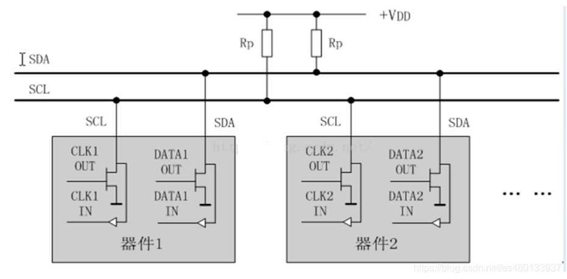
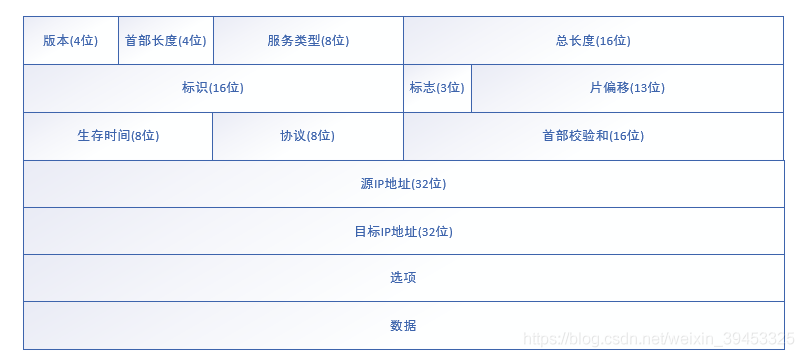
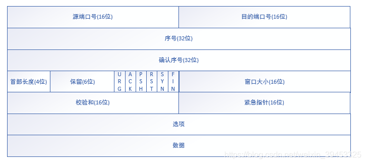

## 总线通信

UART IIC SPI代码见https://github.com/dumpo/my_verilog_projects

#### UART

https://www.cnblogs.com/liujinggang/p/9535366.html

- 特点：全双工，异步，无主从结构，需要双方波特率一致。

- 接口：TX，RX

- 串口通信的规范如下：

  1. 空闲状态(没有数据传输的状态)下，串行传输线上为高电平1
  2. 发送方发送低电平0表示数据传输开始，这个低电平表示传输的起始位
  3. 8-bit的数据位(1 Byte)是从最低位开始发送，最高位最后发送
  4. 数据位的最高位发送完毕以后的下一位是奇偶校验位，这一位可以省略不要，同时，当不发送奇偶校验位的时候接收方也相应的不接收校验位
  5. 最后一位是停止位，用高电平1表示停止位

  

- 发送：波特率发生、数据发送

- 接收：与发送类似，但是有几点要注意

  1. 需要判断串行数据流的起始位，所以还要加一段检测串行数据流下降沿的逻辑
  2. 异步接收，所有接收信号需要同步
  3. 每bit只采样一次容易受干扰出错，因此采样率需要高于波特率，采样多次求平均。

#### I2C

转自https://www.cnblogs.com/liujinggang/p/9656358.html

https://blog.csdn.net/as480133937/article/details/105366932/

- 特点：半双工。同步。多主多从（同一时间只有一个主机）。每个从机有唯一地址。低速。**SCL和SDA都需要接上拉电阻**。**各设备连接到总线的输出端时必须是漏极开路（OD）输出或集电极开路（OC）输出**

  

- 接口：SCK，SDA

- **I2C 总线在传送数据过程中共有三种类型信号， 它们分别是：开始信号、结束信号和应答信号。**

  - **开始信号**：SCL 为高电平时，SDA 由高电平向低电平跳变，开始传送数据。
  - **结束信号**：SCL 为高电平时，SDA 由低电平向高电平跳变，结束传送数据。
  - **应答信号**：接收数据的 IC 在接收到 8bit 数据后，向发送数据的 IC 发出特定的低电平脉冲，表示已收到数据。CPU 向受控单元发出一个信号后，等待受控单元发出一个应答信号，CPU 接收到应答信号后，根据实际情况作出是否继续传递信号的判断。若未收到应答信号，由判断为受控单元出现故障。

  这些信号中，起始信号是必需的，结束信号和应答信号，都可以不要。

  

- 有效的数据位传输

  　　在 IIC 总线上传送的每一位数据都有一个时钟脉冲相对应(或同步控制)，即在 SCL 串行时钟的配合下，数据在 SDA 上从高位向低位依次串行传送每一位的数据。进行数据传送时，在 SCL 呈现高电平期间，SDA 上的电平必须保持稳定，低电平为数据 0，高电平为数据 1。**只有在 SCL 为低电平期间，才允许 SDA 上的电平改变状态**。

- 应答信号与非应答信号

  I2C 总线上的所有数据都是以 8 位字节传送的，发送器(主机)每发送一个字节，就在**第9个时钟脉冲**期间释放数据线，由接收器(从机)反馈一个应答信号。**应答信号为低电平时，规定为有效应答位(ACK)**，表示接收器已经成功地接收了该字节；应答信号为**高电平时，规定为非应答位(NACK)**，一般表示接收器接收该字节没有成功。

  对于反馈有效应答位 ACK 的要求是，接收器在第 9 个时钟脉冲之前的低电平期间将 SDA 线拉低，并且确保在该时钟的高电平期间为稳定的低电平。

  对非应答位(NACK)还要特别说明的是，还有以下四种情况IIC通信过程中会产生非应答位：

  1. ​	接收器(从机)正在处理某些实时的操作无法与主机实现IIC通信的时候，接收器(从机)会给主机反馈一个非应答位(NACK)
  2. ​	主机发送数据的过程中，从机无法解析发送的数据，接收器(从机)也会给主机反馈一个非应答位(NACK)
  3. 主机发送数据的过程中，从机无法再继续接收数据，接收器(从机)也会给主机反馈一个非应答位(NACK)
  4. 主机从从机中读取数据的过程中，主机不想再接收数据，**主机会给从机反馈一个非应答位(NACK)**

- 主机通过IIC总线往从机里面写数据

  ​		主机通过IIC总线往从机中写数据的时候，主机首先会发送一个**起始信号**，接着把IIC**从机的7位设备地址后面添一个0**(设备地址后面的0表示主机向从机写数据，1表示主机从从机中读数据)组成一个8位的数据，把这个**8位的数据发给从机**，发完这8位的数据以后主机马上释放SDA信号线等待从机的应答，如果从机正确收到这个数据，从机就会发送一个有效应答位0给主机告诉主机已经收到了数据，主机收到从机的有效应答位以后 ，接下来**主机会发送想要写入的寄存器地址**，寄存器发送完毕以后主机同样会释放SDA信号线等待从机的应答，从机如果正确收到了主机发过来的寄存器地址，从机会再次发送一个有效应答位给主机，主机收到从机的有效应答位0以后，接下来**主机就会给从机发送想要写入从机的数据**，从机正确收到这个数据以后仍然像之前两次一样会给主机发送一个有效应答位，主机收到这个有效应答位以后给从机发送一个停止信号，整个传输过程就结束了。下图是整个传输过程的示意图：

  (图中灰色的地方表示主机正在控制SDA信号线，白色的地方表示从机正在控制SDA信号线)

- 主机通过IIC总线从从机里面读数据

  　　　　主机通过IIC总线从从机中读数据的过程与写数据的过程有相似之处，但是读数据的过程还多了一些额外的步骤。主机从从机读数据时主机首先会发送一个**起始信号**，接着把IIC从机的7位设备地址后面添一个0(设备地址后面的0表示主机向从机写数据，1表示主机从从机中读数据)，把这个**8位的数据发给从机**，发完这8位的数据以后主机马上释放SDA信号线等待从机的应答，如果从机正确收到这个数据，从机就会发送一个有效应答位0给主机告诉主机自己已经收到了数据，主机收到从机的有效应答位以后 ，接下来主机会**发送想要读的寄存器地址**，寄存器发送完毕以后主机同样会释放SDA信号线等待从机的应答，从机如果正确收到了主机发过来的寄存器地址，从机会再次发送一个有效应答位给主机，主机收到从机的有效应答位0以后，主机会**给从机再次发送一次起始信号**，接着把IIC从机的**7位设备地址后面添一个1**(设备地址后面的0表示主机向从机写数据，1表示主机从从机中读数据)，注意，第一次是在设备地址后面添0，这一次是在设备地址后面添1，把**这个8位的数据发给从机**，发完这8位的数据以后主机马上释放SDA信号线等待从机的应答，如果从机正确收到这个数据，从机就会发送一个有效应答位0给主机告诉主机自己已经收到了数据，接着**从机继续占用SDA信号线给主机发送寄存器中的数据，发送完毕以后，主机再次占用SDA信号线发送一个非应答信号1给从机**，主机发送一个停止信号给从机结束整个读数据的过程。下图是整个读数据过程的示意图

  (图中灰色的地方表示主机正在控制SDA信号线，白色的地方表示从机正在控制SDA信号线)

### SPI

转自https://www.cnblogs.com/liujinggang/p/9609739.html

- 特点：全双工，同步，一主多从，四根线，通过移位寄存器收发同时，高速

  

- 接口：SCK串行时钟，MISO，MOSI，SS#低电平有效片选

- 四种模式：由时钟极性(CPOL，Clock Polarity)和时钟相位(CPHA，Clock Phase)来定义，其中CPOL参数规定了SCK时钟信号空闲状态的电平，CPHA规定了数据是在SCK时钟的上升沿被采样还是下降沿被采样。其中比较常用的模式是模式0和模式3。

  - 模式0：CPOL= 0，CPHA=0。SCK串行时钟线空闲是为低电平，数据在SCK时钟的上升沿被采样，数据在SCK时钟的下降沿切换
  - 模式1：CPOL= 0，CPHA=1。SCK串行时钟线空闲是为低电平，数据在SC K时钟的下降沿被采样，数据在SCK时钟的上升沿切换
  - 模式2：CPOL= 1，CPHA=0。SCK串行时钟线空闲是为高电平，数据在SCK时钟的下降沿被采样，数据在SCK时钟的上升沿切换
  - 　模式3：CPOL= 1，CPHA=1。SCK串行时钟线空闲是为高电平，数据在SCK时钟的上升沿被采样，数据在SCK时钟的下降沿切换

  

- 接口时序：SPI协议规定一个SPI设备不能在数据通信过程中仅仅充当一个发送者（Transmitter）或者接受者（Receiver）。在片选信号CS为0的情况下，每个clock周期内，SPI设备都会发送并接收1 bit数据，相当于有1 bit数据被交换了。数据传输高位在前，低位在后（MSB first）。

  

  

### 

### 以太网

#### 以太网帧结构

| 字段           | 含义                                                         |
| -------------- | ------------------------------------------------------------ |
| 前同步码       | 用来使接收端的适配器在接收 MAC 帧时能够迅速调整时钟频率，使它和发送端的频率相同。前同步码为 7 个字节，1 和 0 交替。 |
| 帧开始定界符   | 帧的起始符，为 1 个字节。前 6 位 1 和 0 交替，最后的两个连续的 1 表示告诉接收端适配器：“帧信息要来了，准备接收”。 |
| 目的地址       | 接收帧的网络适配器的物理地址（MAC 地址），为 6 个字节（48 比特）。作用是当网卡接收到一个数据帧时，首先会检查该帧的目的地址，是否与当前适配器的物理地址相同，如果相同，就会进一步处理；如果不同，则直接丢弃。 |
| 源地址         | 发送帧的网络适配器的物理地址（MAC 地址），为 6 个字节（48 比特）。 |
| 类型           | 上层协议的类型。由于上层协议众多，所以在处理数据的时候必须设置该字段，标识数据交付哪个协议处理。例如，字段为 0x0800 时，表示将数据交付给 IP 协议。 |
| 数据           | 也称为效载荷，表示交付给上层的数据。以太网帧数据长度最小为 46 字节，最大为 1500 字节。如果不足 46 字节时，会填充到最小长度。最大值也叫最大传输单元（MTU）。  在 Linux 中，使用 ifconfig 命令可以查看该值，通常为 1500。 |
| 帧检验序列 FCS | 检测该帧是否出现差错，占 4 个字节（32 比特）。发送方计算帧的循环冗余码校验（CRC）值，把这个值写到帧里。接收方计算机重新计算 CRC，与 FCS 字段的值进行比较。如果两个值不相同，则表示传输过程中发生了数据丢失或改变。这时，就需要重新传输这一帧。 |

- **ARP协议**

  “Address Resolution Protocol”（地址解析协议）

  源主机发出 ARP 请求，询问“IP 地址是 192.168.0.1 的主机的mac地址是多少”，并将这
  个请求广播到本地网段（以太网帧首部的硬件地址填 FF:FF:FF:FF:FF:FF 表示广播），目的主
  机接收到广播的 ARP 请求，发现其中的 IP 地址与本机相符，则发送一个 ARP 应答数据包
  给源主机，将自己的硬件地址填写在应答包中。

  FPGA中可使用ARP映射表，apr -s进行静态映射。

  

- IP协议

  

  

- UDP协议 /TCP协议

  UDP 是 User Datagram Protocol   的缩写。是 OSI （Open System
  Interconnection，开放式系统互联） 参考模型中一种**无连接**的传输层协议，提供面向事务的
  简单不可靠信息传送服务  。不提供数据包分组、组装和不能对数据包进行排序，当报文发送之后，无法得知其是否安全完整到达的。  

  TCP：面向连接（三次握手四次挥手），流量控制（窗口）可乱序（给包排序）。

  

- MII接口

  MAC与PHY的通信协议，还有GMII、RMII等。

  

- ### AXI总线

- ### SDRAM

  

  

## 计算机体系结构

- RSIC与CSIC

- 流水线结构

  - 超流水

  - 旁路

  - 分支预测
  - 超标量
  - 多发射
  - 乱序执行

- 储存

  - cache
  
  - MMU
  - TLB
  
  - ROM
  - RAM
  
    - SRAM
    - DRAM
  
    - SDRAM
    - DDR SDRAM

## 低功耗设计基础