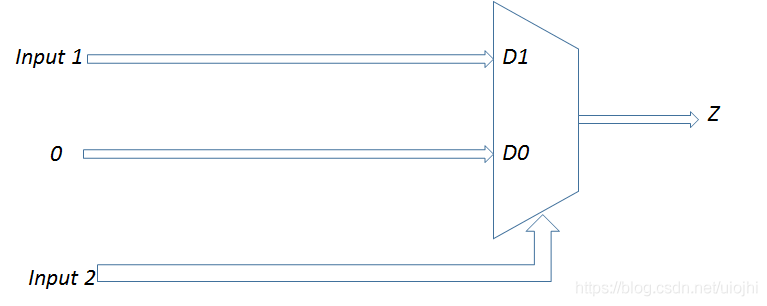
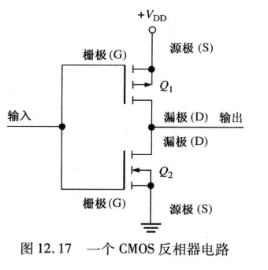
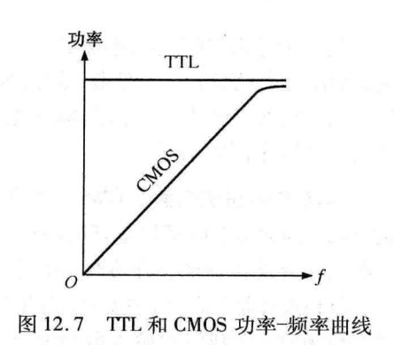
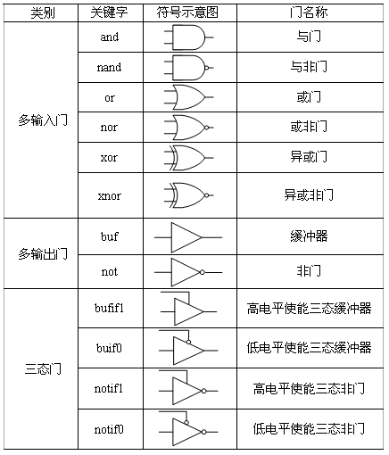

# 数字电子技术


###  ASIC流程flow

```mermaid
graph TB
A[需求]-->B[芯片架构]
B-->C[rtl编写]
C-->D[功能仿真验证]
D-->E[综合与DFT]
E-->F[形式验证]
F-->G[STA静态时序分析]
G-->H[布局布线]
H-->I[时钟树综合与后端优化]
I-->J[设计规则检查 布线图原理图检查]
J-->K[生产GDSII Tapeout]

```

#### DFT

​	可测性设计，插入用于测试的硬件逻辑，提高芯片的可测性。主要包括内部扫描、内建测试和边界扫描三种。

#### 形式验证

​	保证综合后的网表功能与RTL一致，或者网表与版图的一致。静态验证的一种。

#### 时序约束和分析

​	通过计算各通路的延迟，确保setup、hold、skew、clockfrequency等指标符合要求，并优化面积、功耗性能。包括STA静态时序分析DTA动态时序分析。

### FPGA流程flow

```mermaid
graph TD
A[系统规划]-->B[rtl设计]
B-->C[功能仿真<br>前仿 RTLLevel]
C-->D[综合 布局布线]
D-->E[时序仿真<br>后仿 GateLevel]
E-->F[板级验证]

```

### 工具使用

- 时序分析：PrimeTime
- Verilog/SystemVerilog编译仿真：VCS+Verdi/
- 形式验证 formality
- 综合工具：DC
- 各种工具的自动化：TCL脚本 
- Linux自动化：SHELL/Python脚本
- 编译过程自动化：Makefile 
- 文本处理等：Python/Perl


### 组合逻辑

- #### 最大最小项
  最小项：在n变量逻辑函数中，每一个变量都参加，但只能以原变量或者反变量出现一次所组成的**与**项；由于每个变量都参加，所以最小项取指为1的概率**最小**，故得名
  
  最大项：在n变量逻辑函数中，每一个变量都参加，但只能以原变量或者反变量出现一次所组成的**或**项；由于每个变量都参加，所以最小项取指为1的概率**最大**，故得名

- #### 转换为与非或非形式

- #### MUX实现异或

- 

- #### MUX实现and




- #### 异或实现与非，与非实现异或

- #### 二选一mux实现四选一mux

- #### 逻辑化简公式
  逻辑函数的表达形式：
  1. 真值表
  2. 函数表达式
  3. 逻辑图

### 时序逻辑

- #### 同步逻辑和异步逻辑的

- ####   同步时序逻辑的门电路实现

  1.状态转移图、状态转换表
  2.状态化简
  3.状态分配
  4.求状态方程、驱动方程
  5.逻辑图

- #### 竞争和冒险的区别，成因，危害，处理方法

  信号由于经由不同路径传输达到某一汇合点的时间有，先有后的现象，就称之为竞争。

  同一线被不同值驱动称为冒险。

  由于竞争现象所引起的电路输出发生瞬间错误的现象，就称之为竞争冒险。

  FPGA设计中最简单的避免方法是尽量使用时序逻辑同步输入输出。
  另外：加滤波电容，消除毛刺的影响
  	加选通信号，避开毛刺
  	增加冗余项，消除逻辑冒险。  

- #### 卡诺图化简与消除竞争冒险
  表示最小项之间关系的图形叫做卡诺图
  
  将卡诺图中相邻的未被圈的 数量为2^N的”1“圈起来。

- #### 特殊门电路
  门电路的局限性：
  1. 输出端不能相互连接，因为当输出点评不一致时会出现短路
  2. 其输出的高电平受电源电压的影响

 - ##### OC/OD门
  改进方法是使门电路的输出端开路，从而使输出不受器件电源的影响：输出端开路的TTL门电路为OC（open collector）;输出端开路的CMOS门电路为OD（open drain）;
  
  OC门或OD门只能输出低电平和高阻状态，高电平通过加上拉电阻完成，可以互相连接完成“**线与**”。
  **推挽输出**结构的低电平输出能力与OC门或OD门是一样的，但是高电平输出能力比OC门或OD门强很多，因为是直接上拉到了电源！因此推挽输出可以输出很高的电流。
  需要注意的是，配置为推挽输出的两个管脚，不能连一起，一个配置为输出高，另一个配置为输出低，会产生很大的电流，导致IO烧毁。

  **典型应用**：
  1. 由于OC/OD门输出低电平时，能够吸收较大的“灌电流”，并且负载电源电压不受驱动门电源电压的限制，因为*能够驱动高电压、大电流负载*。
  2. 可以用于不同逻辑电平器件间的接口电路，实现“线与”的逻辑功能。（输出端直接连在一起，如果至少有一个为低电平则输出为低电平，只有当两个器件都输出高阻状态时，通过上拉电阻输出高电平）。

- ##### 三态门
  普通门电路不能作为总线接口使用，要求具有高阻状态；当门电路输出高阻状态时，无论总线为高电平还是低电平平均不取电流，因此不影响其他设备使用总线。

  **典型应用**：
  1. 作为总线接口电路
  2. 控制数据双向传输（i2c inout）
  
- 锁存器与触发器的区别

- #### 门电路实现latch，DFF

- #### 斯密特触发器

- #### 环形振荡器

  利用门电路固有传输延迟，将奇数个反相器首尾相连的振荡器。振荡周期：$T=2*N*T_d$

  

  

### CMOS

#### CMOS实现门电路

- ##### 反相器T_d



- ##### 与非

上并下串

- ##### 或非

##### 

上串下并

#### CMOS与TTL对比

- ##### 逻辑电平

#### 

 TTL的噪声容限更小，悬空为高电平。

- ##### 功耗



  TTL电路的功耗在工作频率的范围以内基本上是恒定 的。但是，CMOS电路的功耗则和频率有关。在静态（直流）条件下它的功耗是非常小的，并随着频率的增加而增加。这些特性如图12 . 7 中总的曲线所示。例如，一个低功耗肖特基（LS）TTL门电路的功耗是常量2.2 mW。一个 CMOS n电路的功耗在静态条件下是2.75uW,在频率为100kHz 时是170uW

   

- ##### 负载和扇出

  扇出是指在不会对门的工作特性造成不利影响的情况下，门所能够连接的负载门输人的最 大数目。例如，低功耗肖特基( L S ) T T L 电路的扇出是2 0 个单位负载。作为驱动电路的相同逻 辑系列的一个输入称为一个单位负载。

CMOS电路的负载不同于TTL电路 的负载，因为CMOS逻辑电路所使用的晶体管为驱动门提供了 一种占主导地位的电容性负载，限制条件是与驱动门输出电阻和负载门输人电容相关的充电和放电时间。当驱动门的输出 是高电平时，负载门的输人电容通过驱动门的输出电阻充电。当驱动门电路的输出是低电平 时，电容放电。如果给驱动门的输出添加更多的负载门输人，那么总的电容将会增加，因为输人电容实 际上是并行出现的。电容的增加会延长充电和放电时间，因此就会降低这个门电路的最大工 作频率。因此，C M O S  电路的扇出是和工作频率有关的。负载门输入越少，最大频率就 越高。

  TTL驱动门向处于高电平状态的负载门提供灌电流,从处于低电平状态的负载门吸收拉电流，当更多的负载门连接到驱动门时，驱动门电路上的负载就会增加。总的灌电流随着每增加 一个门输入而增加，随着电流的增加，驱动门内部的电压降也会增加，从而 引起输出电压V0 H 的降低。如果连接过多的负载门输人，V0 H 就会降到低于V0 H ( r a i n ) ,高电平噪声 容限也会降低，从而影响电路的正常工作。同样，随着灌电流的增加，驱动门的功耗也会增加。 
  总的拉电流也会随着每增加一个负载门输人而增加，当拉电流增加时， 驱动门电路内部的电压降也会增加，从而导致V0L
增加。如果添加了过多数的负载，那么将V0L会超过V0L(max),而低电平噪声容限会减小。在TTL电路中，拉电流的能力(低电平输出状态)是决定扇出数量的限制因素。

  

#### PMOS与NMOS，耗尽型与增强型的结构，区别


耗尽型可以工作在增强模式（VGS为正）或耗尽模式（VGS为负），增强型没物理沟道，衬底延伸到绝缘栅，只能工作在增强模式，低于阈值电压都是关断。

耗尽型与增强型的主要区别在于耗尽型MOS管在G端（Gate）不加电压时有导电沟道存在，而增强型MOS管只有在开启后，才会出现导电沟道；两者的控制方式也不一样，耗尽型MOS管的VGS（栅极电压）可以用正、零、负电压控制导通，而增强型MOS管必须使得VGS>VGS（th）（栅极阈值电压）才行。

这些特性使得耗尽型MOS管在实际应用中，当设备开机时可能会误触发MOS管，导致整机失效；不易被控制，使得其应用极少。因此，日常我们看到的NMOS、PMOS多为增强型MOS管；耗尽型用于功率器件。n型是电子导电，p型是空穴导电。电子迁移率高于空穴，因此PMOS由于存在导通电阻大、价格贵、替换种类少等问题，n型更常用。

### <span id="jump1">编码</span>

- ##### 格雷码与独热码

  格雷码：相邻之间只变1bit，编码密度高。功耗低；可用于CDC。状态机中可节省状态寄存器，适合写适合写条件不复杂但是状态多的状态机。；
  独热码：任何状态只有1bit为1，其余皆为0，编码密度低。但译码方便，节省组合逻辑；稳定性强，任意1bit错误都不会产生毛刺，适合写条件复杂但是状态少的状态机；

  （对于FPGA，可用资源数固定，资源足够就用独热码）


- ##### 二进制与格雷码的转换
  
  自然二进制码转换成二进制格雷码，其法则是保留自然二进制码的最高位作为格雷码的最高位，而次高位格雷码为二进制码的高位与次高位相异或，而格雷码其余各位与次高位的求法相类似。实际操作时将只需将二进制码右移一位再与原值异或就行。只需一行代码：
```verilog
  assign  graydata = (bindata >> 1) ^ bindata;
```

  保留格雷码的最高位作为自然二进制码的最高位，二进制码的次高位为格雷码的次高位与二进制码的(次高位+1)进行异或，其余各位采用类似的方法。代码如下：

  ```verilog
  assign {bindata[7],bindata[6:0]}={graydata[7],bindata[7:1]^bindata[6:0]}
  ```


## Verilog设计

#### 连续赋值assign与always过程赋值

  - 在连续赋值语句中，表达式右侧的计算结果可以立即更新表达式的左侧。在理解上，相当于一个组合逻辑之后直接连了一条线，这个逻辑对应于表达式的右侧，而这条线就对应于wire。 

  - 在过程赋值语句中，表达式右侧的计算结果在某种条件的触发下放到一个变量当中，而这个变量可以声明成reg类型。根据触发条件的不同，过程赋值语句可以建模不同的硬件结构：如果这个条件是时钟的上升沿或下降沿，那么这个硬件模型就是一个触发器；如果这个条件是某一信号的高电平或低电平，那么这个硬件模型就是一个锁存器；如果这个条件是赋值语句右侧任意操作数的变化，那么这个硬件模型就是一个组合逻辑。

#### wire和reg类型的区别

  - ##### 基本概念的差别
    
    wire型数据常用来表示以assign关键字指定的组合逻辑信号，模块的输入输出端口类型都默认为wire型**，wire相当于物理连线，默认初始值是z**。
    reg型表示的寄存器类型，用于always模块内被赋值的信号，必须定义为reg型，代表触发器，常用于时序逻辑电路，**reg相当于存储单元，默认初始值是x**。
    
  - ##### 在赋值语句中的差别
    
    在连续赋值语句中，表达式右侧的计算结果可以立即更新表达式的左侧。在理解上，相当于一个逻辑之后直接连了一条线，这个逻辑对应于表达式的右侧，而这条线就对应于wire。
    在过程赋值语句中，表达式右侧的计算结果在某种条件的触发下放到一个变量当中，而这个变量可以声明成reg类型。根据触发条件的不同，过程赋值语句可以建模不同的硬件结构：如果这个条件是时钟的上升沿或下降沿，那么这个硬件模型就是一个触发器；如果这个条件是某一信号的高电平或低电平，那么这个硬件模型就是一个锁存器；如果这个条件是赋值语句右侧任意操作数的变化，那么这个硬件模型就是一个组合逻辑。
    总而言之，**wire只能被assign连续赋值，reg只能在initial和always中赋值**
    
  - ##### 端口信号和内部信号的差别
    
    信号可以分为端口信号和内部信号。出现在端口列表中的信号是端口信号，其它的信号为内部信号。
    对于端口信号，一旦定义位input或者output端口，默认就定义成了wire类型，输入端口只能是net类型（wire/tri）。输出端口可以是net类型，也可以是reg类型。若输出端口在过程块中赋值则为register类型；若在过程块外赋值(包括实例化语句），则为net类型。
    内部信号类型与输出端口相同，可以是net或reg类型。判断方法也与输出端口相同。若在过程块中赋值，则为reg类型；若在过程块外如assign赋值，则为net类型。
    若信号既需要在过程块中赋值，又需要在过程块外赋值。这种情况是有可能出现的，如决断信号。这时需要一个中间信号转换。
    inout是一个双向端口, inout端口不能声明为reg类型，只能是wire类型。
    
    

#### 阻塞赋值与非阻塞赋值的区别

-   非阻塞赋值在触发调节满足是，两条语句是同时进行的，一般时序逻辑用非阻塞赋值
-   阻塞赋值是顺序执行的，一般组合逻辑用阻塞赋值

#### founction与task的区别

|      |                             task                             |                          founction                           |
| :--: | :----------------------------------------------------------: | :----------------------------------------------------------: |
| 定义 | 任务不能出现always语句；可以包含延时控制语句（#）,事件控制@等，但只能面向仿真，不能综合（可综合的任务只能实现组合逻辑） |      函数定义不能包含任何的时间控制语句，即#、@或者wait      |
| 包含 |              task可以包含其它的task和function。              |                     function不能包含task                     |
| 输入 |             task可以没有或者有多个任意类型的变量             |                  function至少有一个输入变量                  |
| 返回 | task则不返回值，也可以通过输出端口或双向端口返回一个或多个值 | function返回一个值，在函数的定义中，必须有一条赋值语句给函数中的一个内部变量赋以函数的结果值，该内部变量与函数具有相同的名字 |
| 调用 |            任务调用语句可以作为一条完整的语句出现            | 函数调用语句不能单独作为一条语句出现，只能作为赋值语句的右端操作数 |


#### localparam、parameter和define的区别 

|          | localparam | parameter    | define    |
| -------- | ---------- | ------------ | --------- |
| 作用域   | 当前module | 当前module   | 整个工程  |
| 参数传递 | 不可以     | 可           | 可        |
| 重定义   | 不可以     | defparameter | undef失效 |

注释：parameter如果在模块内部定义时视为localparam，无法进行参数传递，在模块名后写可以传递可以defparameter.

#### case casex casez的区别

- 语法
  - case语句的表达式的值有4中情况：0、1、z、x。4种是不同的，故表达式要严格的相等才可以操作分支语句。
  - casez语句中的表达式情况有三种：0、1、x。不用关心z，z可以和任何数值相等，即z =0.z= 1,z=x;
  - casex语句的表达式情况有二种：0、1.不用关心x和z。即x=z=0,x=z=1
- 综合
  -    都是可综合的
  - ​	case（不是casez/casex的时候）的index列表里面的x和z，都被综合工具认为是不可达到的状态就被去掉了
  - ​	casez和casex里面的x/z都被认为是**don't care**，所以综合出的电路会是一致的，因此这两个在综合来看没有孰优孰劣 ，会引起前仿后仿不一致，尽量不要用，若出现X必须分析是否会传递下去！

- 注意：要明确的是在case/casez/casex中'?'代表的不是don't care，而是'z'

#### 高阻态的意义和用法

- ​	该点输入电阻（输出电阻）无穷大，相当于断路，管角悬空，既不是高电平也不是低电平，其电平随外部电平高低而定。
- **应用实例1：**在总线连接的结构上。总线上挂有多个设备，设备与总线以高阻的形式连接。这样在设备不占用总线时自动释放总线，以方便其他设备获得总线的使用权。
- **应用实例2：**大部分单片机I/O使用时都可以设置为高阻输入，如STM32，AVR等等。高阻输入可以认为输入电阻是无穷大的，认为I/O对前级影响极小，电平随外部电平高低而定，除了高电平/低电平还能读中间的值，可用于AD连接。

#### 三态门的例化

- 使用门级建模 bufif0、bufif1、notif0 notif1

  

- 使用inout关键字，注意inout不可单独存在，其输入输出必须是reg类型，且非顶层模块尽量不使用inout。

  ```verilog
  inout    data_inout;
  input    data_in;
  reg      data_reg;//data_inout 的映象寄存器
  reg      link_data;
  assign data_inout = link_data ? data_reg : 1’bz; //link_data 控制三态门
  always@(*) data_reg=data_in;
      
  ```

  

#### 线与/线或

​	wand，wor，一条线上有多个同强度的驱动时，执行与/或

#### 系统函数

- clog2函数

  `$clog2`返回2为底的向上取整的对数，用于计算位宽。

-  `$signed`和`$unsigned`。首先明确这两个语句是可综合的。`$signed(c)`是一个function，将无符号数c转化为有符号数返回，不改变c的类型和内容。接上述代码历程：$unsigned同理。

  

#### 顺序块和并行块

- 顺序块（也称过程块）

  关键字begin_end

  顺序块中的语句一条条按顺序执行，只有前面语句执行完才执行后面的语句（除了带有内嵌延时控制的非阻塞赋值语句）。

  如果语句包括延时或事件控制，那么延迟总是相对于前面那条语句执行完成的仿真时间的

- 并行块（**<u>不可综合</u>**）

  关键字fork_join

  并行块内的语句是并发执行的；

  语句的执行的顺序是由各自语句内延迟或事件控制决定的

  语句中的延迟或事件控制是相对于块语句开始执行的时刻而言的。

- 可以嵌套

#### 命名块与生成块

- ​	命名块的定义：begin：name     
- 通过关键字disable提供了一种中止命名块执行的方法。disable可以用来从循环中退出、处理错误条件以及根据控制信号来控制某些代码是否被执行。对块语句的禁用导致紧接在块后面的那条语句被执行。disable则可以禁用设计中的任何一个命名块。
- generate可以循环生成，条件生成，case生成，综合时候只是按条件展开代码，可以简化代码提高可读性。


---

#### Verilog的延迟模型

- ​	惯性延迟

  可检测的最小脉冲宽度，相当于滤波，宽度低于惯性延迟的将被忽略。原因是器件和连线的电容效应，使具有“惯性”，电平不会突变。

  ```verilog
  assign #5 wireIn=~wireOut //在持续赋值语句前使用延时，可以描述惯性延时
      (#5) a = b   //延迟5单位后赋值，一般用于TB，非描述惯性延时！
  ```

- ​	传播延迟

  ```verilog
  a = (#5) b; //描述组合逻辑传播延迟
  a <= (#5) b//描述FF的传播延迟
  ```

#### Verilog的时序检查

- ​	specify块

  specify block用来描述从源点（source：input/inout port）到终点（destination：output/inout port）的路径延时（path delay），由specify开始，到endspecify结束，specify block可以用来执行以下三个任务：

  - 描述横穿整个模块的各种路径及其延时。（module path delay）

  - 脉冲过滤限制。（pulse filtering limit）

  - 时序检查。（timing check）

​	specify block有一个专用的关键字specparam用来进行参数声明，用法和parameter一样，不同点是两者的作用域不同：specparam只能在specify block内部声明及使用，而parameter只能在specify block外部声明及使用。

- 模块路径声明：

  先描述模块，再把延迟赋值给路径。路径有三种：simple path，edge-sensitive path，State-dependent path。

  - 模块路径的要求
    1. 源信号(src)应该是模块的i叩ut或inoutport。 
    2. 源信号(src)可以是scalar和vector的任意组合。
    3. 目的信号(dst)应该是模块的output或inoutport。
    4. 目的信号(dst)可以是scalar和vector的任意组合。
    5. 目的信号(dst)应该只能被一个驱动源(Driver)驱动。

- 简单路径

  简单路径(Simple path)可以使用下面的两种连接类型。 

  1. src *> dst：用于 src 和 dst 之间的全连接(Full connection)。 
  2. src => dst：用于 src 和 dst 之间的并行连接(Parallel connection)。

  ```verilog
  module mux8 (ini, in2, s, q); 
      output [7:0] q; 
      input [7:0] ini, in2; 
      input s; // Functional description omitted ... 
      specify 
          (ini => q) = (3, 4); //parallel connection 
          (in2 => q) = (2, 3); //parallel connection 
          (s *> q) = 1;		//full connection
          endspecify 
  endmodule
  ```

  

- 模块路径极性(Module path polarity):

  - 1. Unknown polarity：使用 *> 和=>, src rise 导致 dst rise> fall or no change, src fall 导致 dst rise、fall or no_change。 *
    2. Positive polarity：使用 +*> 和 +=>, src rise 导致 dst rise or no change» src fall 导致 dst fall or no change。 *
    3. Negative polarity：使用-*> 和-=>, src rise 导致 dst fall or no change, src fall 导致 dst rise or no change。

- 边沿敏感路径

  沿敏感路径(Edge-sensitive path)就是在描述模块路径时对src使用了沿转换(Edge transition),用于描述在src指定沿上发生的input-to-output延迟。 

  沿敏感路径的使用原则如下： 

  1.    沿(Edge)可以是 posedge 或 negedge，与 src—起使用。 
  2.    如果src是vector,那么就只检查最低位(LSB)的沿转换。 
  3.    如果没有指定沿转换，那么src的任意沿转换都会导致路径有效。 
  4.    沿敏感路径可以使用=> 和*>o 对于 =>,dst应该是scalar； 对于 *>, dst可以是scalar或vector。 
  5.    沿敏感路径可以指出datapath的关系： +: (not invert)» -: (invert), : (not specify)。

  ```verilog
  //I. module path posedge clock--> out: rise delay=10, fall delay=8. 
  // data path in ——>out: not invert 
  (posedge clock => (out +: in)) = (10, 8); //2. module path negedeg clock——> out: rise delay=10, fall delay=8. 
  // data path in -->out: invert 
  (negedge clock => (out -: in)) = (10, 8); 
  //3. module path any_edge clock--> out: rise delay=10, fall delay=8. 
  // data path in -->out: not specify 
  (clock => (out : in)) = (10, 8); 
  //4. module path posedge clock--> out: rise delay=10, fall delay=8. 
  // no data path 
  (posedge clock => out) = (10, 8);
  
  ```

- 状态依赖路径

  对于状态依赖路径(State-dependent path),只有在指定的条件为true时，对应的延迟才能起作用。 状态依赖路径包含三部分：条件表达式(Conditional expression)、模块路径描述、模块路径上的延迟。 

  状态依赖路径语法如下：

  ```verilog
  if (module_path_expression ) simple_path_declaration 
  if (module_path_expression ) edge_sensitive_path_declaration 
  ifnone simple_path_declaration 
  ```

  条件表达式使用如下规则。 

  1. 条件表达式可以使用模块的input或inout port＞它们的bit-select或part-select、模块内定义 线网或变量、常数、specparams。 
  2. 如果条件表达式的值是x或z，那么也认为是true。
  3. 如果条件表达式的值是multi-bit,那么只检查最低位(LSB)。 
  4. ifnone用于当所有条件为false时默认的状态依赖路径。 
  5. ifnone只能用于简单路径。

- 模块路径延迟

  模块路径赋值的原则如下：

  1. 左侧是模块路径描述，右侧是一个或多个延迟值。
  2. 延迟值可以放在一个括号内。 
  3. 延迟值可以是常数，也可以是specparamso 
  4. 延迟值可以是一个数值，也可以是一个表示(maxlyp:min)的三元组。 
  5. 对于路径延迟与信号转换的关系，可以指定1、2、3、6或12个延迟值。 

- 时序检查

  - 使用$开头的命令，<u>非系统命令</u>，系统命令不能出现再specify块内，时序检查命令不可在specify块外
  - 稳定时间窗口描述，检查事件发生的时间窗口 ，有＄setup、＄hold、＄setuphold、＄recovery、＄removal、＄recrem
  - 时钟和控制信号检查，检查时间两个事件的差值，有＄skew、＄timeskew、＄fullskew、 ＄width、$width、$period、$nochange


