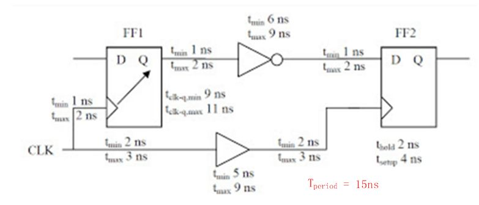

### 时序约束

#### 约束的分类

- 时钟约束

  

- IO约束

- 时序例外约束

  

  - 虚假路径	

    不需要满足任何时序要求的路径，EDA忽略该路径的时序

  - 多周期路径

    需要多个周期来传输数据的路径，EDA放宽该路径的时序

  - 最小延迟和最大延迟

    当有对最小延迟和最大延迟有特殊要求（与setup、hold约束的推测值不同）时指定

#### 时序约束的作用

- 在综合中
  - 优化：面积、功率、性能约束
  - 输入重排序：传达各种输入信号的到达时间
  - 输入缓冲：传达外部输入的驱动能力
  - 输出缓冲：传达输出端口需要驱动外部负载的信息
- 在STA中
  - 约束作为声明：工具不验证准确性和正确性
  - 约束作为断言：检查，若不满足约束认为时序违例
  - 约束作为指令：综合、布局布线时工具根据约束识图满足目标
  - 约束作为异常：指定某些路径，允许更为宽松的时序

#### SDF文件

Standard Delay Format：标准延时格式文件，描述各种延迟约束。

SDC：新思公司的SDF文件

XDC：Xilinx公司的SDF文件，两者格式大致相同

#### OCV

​	OCV（On-chip-Variation），片上变化，OCV（on-chip variation）是指在同一个芯片上, 由于制造工艺和环境（PVT）等原因导致芯片上各部分特征不能完全一样，从而造成偏差，对时序分析造成影响。这些偏差对互联线和cell的延时都是有影响的。

由于OCV对延时有影响，那么我们在进行时序分析时需要将这些OCV效应考虑进来。在STA中，通过对不同的时序路径添加derate系数，来完成对OCV的建模，将OCV效应纳入分析。

#### PTV

​	 PVT也称为Operating condition，分别是Process工艺，Voltage电压，Temperature温度，有下列组合

- WC：worst case slow，低电压，高温度，慢工艺 -> 一般情况下delay最大，setup 差。
- WCL：worst case low-temperature，低电压，低温度，慢工艺 -> <u>温度反转效应</u>时delay最大，setup差。
- LT：即low-temperature，也叫bc（best case fast），高电压，低温度，快工艺 -> 一般情况下delay最小，hold差。
- ML：max-leakage，高电压，高温度，快工艺 -> 温度反转效应下delay最小，hold差。
- TC：typical，也叫tt，普通电压，普通温度，标准工艺 -> 各种typical。
- BC：Best case。高电压，快工艺，常温0℃ or 25℃。
- 注：温度反转效应（Temperature Inversion Effect）
  - 工艺在90nm以上的时候，随着温度的升高，delay增大，所以worst corner是PVTmax，
  - 是65nm以下，随着温度的降低，delay增大，worst corner可能是PVTmax,也可能是PVTmin，这就是温度反转效应。
  - 温度对Transistors的影响：低温时，迁移率增大(导致快switching趋势)，但是Vt增大(导致慢switching趋势)，最后结果取决于迁移率和Vt谁起更重要作用（65nm以下制程主要是Vt起作用，90nm以上主要是电子迁移率）。
  - 温度对寄生参数的影响：低温时，wire电阻更低。

#### 共同路径悲观效应

如下图，common clock path即属于launch clock path，也属于capture clock path，所以在计算中，我们对其使用了不同的derate系数进行计算：在计算arrival time中，系数为1.2；在计算required time中，系数为0.9，这样会让我们的分析更为悲观，电路性能更差。而在真实的情况中，common clock path的PVT只有一个，不可能同时有两个derate系数，所以我们会进行CPPR操作。

**CPPR**（Clock Path Pessimism Removal）或者**CRPR**(Clock Reconvergence Pessimism Removal)，中文名“**共同路径悲观去除**”。它的作用是去除clock path上的相同路径上的悲观计算量，即我们上面提到的问题。我们将common point定义为时钟树上共同部分最后一个cell的output pin。则定义CPP因子为：

```verilog
//同一时钟，一段按最快路径（clk->B）计算，一段按最慢路径(clk->A)计算，导致约束过于悲观。可声明公用部分，修正补偿延迟差异，称为“时钟网络悲观效应降低”

					  +-----+     *****    +-----+      
                      |     +---** C1  *---+     |      
                      | F1  |     *****    | F2  |      
                      |     |              |     |      
                    +-+>A   |         |----+>B   |      
                    | +-----+         |    +-----+      
                    |                 |                 
                    .                 .                 
                   /_\               /_\                
                    |                 |                 
          clk       |                 |                 
          ----------+-----------------+               
```


#### setup time与hold time和什么有关

https://blog.csdn.net/FBICIACCC/article/details/52683901

直观而言，SETUP要求数据要比时钟“走得快”，HOLD则防止采到的新数据太快到达而“冲掉”原来的正确数据，数据必须要在一定时间之后才允许到达。

数据跑得越快（TDelay越小），时钟传输时延越大（clock skew越大）对建立时间的满足越有利，而对保持时间的满足越不利，相反则对满足保持时间越有利，对满足建立时间越不利。

建立时间还跟时钟周期有关系，时钟周期越小，越容易发生建立时间违例，而保持时间则跟时钟周期没有关系。

#### clock Jitter与clock Skew

- clock Skew（时钟偏移）指同一时钟到达不同寄存器的时间偏移。一般由于时钟路径的长度，负载，驱动有关。在上例中，clock skew体现在$T_{clk\_path}$中。
  - 定义为到达后级寄存器的时间减到前级寄存器的时间，从公式可以看出，正skew（clk2晚于clk1）对建立时间有益，负skew（clk2早于clk1）对保持时间有益。
- clock Jitter（时钟抖动）指时钟源的频率不确定。一般由于晶振，电源，温度变化引起。clock jitter始终对电路性能造成负面的影响。
- 时钟约束中，clock uncertainty = clock jitter + clock skew。

#### setup和hold裕度计算

- setup

  $T_{data\_path}+T_{setup}<=T_{clk\_path}+T_{period}$

  变形：$T_{set\_slack} = T_{period} -（T_{cq}+T_{logic}）- T_{setup} + T_{skew}>0$

- hold

  $T_{data\_path}-T_{hold}>=T_{clk\_path}$

  变形：$T_{hold\_slack} = T_{cq}+T_{logic}-T_{hold} - T_{skew} > 0$

- 举例



$T_{data\_path}=2+11+2+9+2=26ns;T_{clk\_path}=2+5+2=9ns;26+4>9+15$

setup违例

$T_{data\_path}=1+9+1+6+1=18ns;T_{clk\_path}=3+9+3=15ns;18-2>15$

 hold无违例

**<u>总结：计算setup时数据路径延迟取最大，时钟路径延迟取最小；计算hold时相反</u>**


## 时序分析

#### 如何查看时序报告

（DC） report-timing

#### 时序分析的分类和任务

- STA静态时序分析

  分析门级网表的拓扑结构，计算所有通路的传输延迟，生成有向无环图。但有可能检查了**无效路径**，从而生成错误虚假的违例警告。

- DTA动态时序分析

  基于电路的行为级、门级、开关级模型进行动态仿真。依赖于激励源，有可能漏掉关键路径，漏报时序违约。

- 两者对比

  |                              | STA          | DTA          |
  | ---------------------------- | ------------ | ------------ |
  | 方法                         | 仿真         | 路径分析     |
  | 激励源                       | 不需要       | 需要         |
  | 覆盖率                       | 与激励源无关 | 与激励源有关 |
  | 风险                         | 警告错误     | 丢失警告     |
  | **最大最小分析**，与综合配合 | 可           | 不可         |
  | 内存占用                     | 小           | 大           |
  | 运行时间                     | 快           | 慢           |

- 任务

  - 建立时间约束
  - 保持时间约束
  - 脉冲宽度约束
  - 时钟偏移（clock skew）约束
  - 时钟周期约束


#### HOLD违例修复：

- **hold违例一般可在后端修复，前端可以忽略**！

- Synopsys 方法

  - two-pass综合

    在排版前，用worst-case lid编译设计，获得最大setup-time,在layout后用best-case lib对设计再映射，从而修正hold-time，这个方法稳定性好。

  - Single pass 综合，通过DC命令

    - Set_fix_hold

        指示DC在采用CLK做时钟的电路合适的位置插入buffer或置换数据路径的cell而修正hold-time。在设计进行layout信息反标之后，用reoptimize _design命令修正hold-time,在layout之前，采用“compile –incremental”命令修正hold-time。

    - reoptimize _design命令

      支持min_max同时分析和优化；反标layout tool提供的min和max延时；用set_fix_hold <clock name>修正hold-time；

- 人为插入delay

  对于少于10-20处的hold-time 违例，可人为插入delay，一般都是通过加入一串连续的buffer,但因为buffer间距离过近，总的延时由buffer的cell延时决定，连接延时很小从而造成延时不足以修正hold-time。解决的办法是将多个高fanin 的门连结在一起，利用fanin 电容比单输入的buffer大，增加延时。

- 用DC命令自动插入延时

  用于hold-time 违例较多，用IPO费很多时间，对时序报告使用的script语言（perl 或 Awk)做语法分析，获得时序分析失败路径setup-time 的slack和hold-time的违例。根据这些结果，对失败路径，用户生成disconnect_net,create_cell,connect的DC命令，指示DC在合适的位置插入buffer.

#### SETUP违例修复：

1.    **可以考虑关键路径上的逻辑并行化（重排部），减少链路延时。**
2.    **可以考虑有些功能电路的更优设计以降低延时，比如，超前进位加法器比行波逐位进位链加法器的延时更短。**
3.    **关键插入寄存器，形成流水线（pipline）。**
4.    FPGA中可尝试：将数据改为下降沿触发，提前半拍发数据增加余量。
5.    后端

   - 后端设计可以通过调整关键路径的时钟SKEW来解决，但是一般只是针对小范围的违例。
   - 可以采用多阈值单元，从半导体器件原理大家都知道，mos管阈值越小，其延时越小，可以在关键路劲采用阈值小的单元。

   - 可以采用面积更小的门级单元，面积大容载大，自然延时大（当然面积大的单元其驱动能力强）。
   - 可以通过适当提高工作电压来解决，电路的延时本质就是充放电的延时，如果电压越高，充放电时间就会越快。这也是为什么CPU超频时需要更高的工作电压。因此也可以通过提高关键模块的工作电压，划分不同的工作电压域。


#### 时序违例的修复

| 方案                         | 作用                             |
| ---------------------------- | -------------------------------- |
| 更换器件，调制器件尺寸(后端) | 减少器件延迟，改善建立和保持裕度 |
| 延长时钟周期(spec)           | 在性能指标约束内消除时序违例     |
| 调制关键路径(后端)           | 减少线网延迟                     |
| 时钟树重新设计(后端)         | 改善时钟偏移                     |
| 更好算法、系统结构（前端）   | 减少通路延迟                     |
| 改变工艺(spec)               | 减少器件和通路延迟               |

